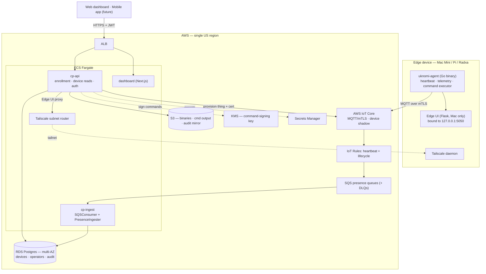
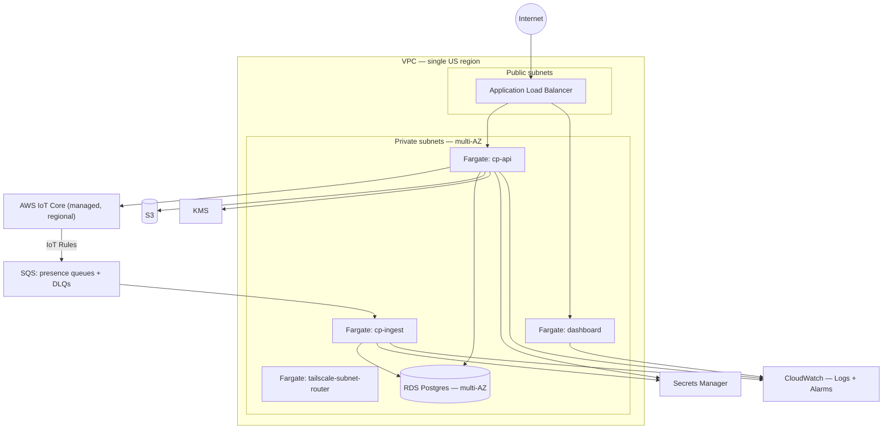

# Architecture

**Status:** Living document. Initial design 2026-05-05; kept current as Phase 1 lands — last updated 2026-05-21, reflecting work through issue #08.
**Scope:** System design covering registry, presence, commands, telemetry, and Edge UI proxy. Mobile readiness is a first-class design constraint. [Modules and implementation status](#modules-and-implementation-status) records what is built so far.

## Goals

- Single dashboard to see online/offline status and key telemetry for all uKnomi edge devices.
- Run remote commands (service restart, run script, reboot) safely and audited, without SSHing into devices.
- Proxy access to each device's local Edge UI (cameras, configuration screens) from the dashboard.
- Multi-OS today (macOS + Linux), with Linux as a deprecating-but-supported tier.
- API-first so a future mobile app for site operators can be added without re-platforming.

## Non-goals

- Not an MDM. Mosyle handles Mac provisioning; CP handles runtime management.
- Not a streaming/RTSP service. Camera live feeds were unreliable; the local Edge UI serves snapshot feeds, and CP proxies the local UI.
- Not a Zabbix replacement (Zabbix is being de-prioritized; CP telemetry covers CP's needs).
- Not multi-tenant SaaS. Single org (uKnomi) with internal staff and (future) scoped operator accounts.

## Constraints

- Devices sit behind NAT at client sites.
- All devices are on a single Tailscale tailnet.
- AWS infrastructure in US regions; clients are US-based; no cross-border data concerns.
- 24/7 uptime required.
- Small operator team (uKnomi staff today; field operators in future).

## High-level architecture



The data path splits in two: the **command/telemetry channel** runs over MQTT to AWS IoT Core; the **Edge UI proxy path** runs over Tailscale (ADR-003). Heartbeats and IoT lifecycle events reach Postgres asynchronously — IoT Rules route them through SQS, where `cp-ingest` consumes them (ADR-018).

## Components

### Edge device agent (`uknomi-agent`)

Single Go binary, cross-compiled to `darwin/arm64`, `darwin/amd64`, `linux/arm64`. Build-tag separated service backend (launchd vs systemd). Installed as a LaunchDaemon on macOS, a systemd unit on Linux.

Responsibilities:
- Maintain persistent MQTT connection to AWS IoT Core (X.509 mTLS).
- Publish heartbeat (every 30s) and telemetry (CPU, mem, disk, service states).
- Subscribe to per-device command topic; verify Ed25519 signatures before executing.
- Execute commands by shelling out to OS primitives (`launchctl`, `systemctl`, `tailscale`) or HTTP-calling localhost Edge UI on Macs.
- Self-update from a signed manifest in S3.

Explicitly does **not** reimplement Edge UI logic — wraps it.

### Command channel: AWS IoT Core

MQTT-over-WSS, per-device X.509 mTLS, device shadow used for desired/reported service state.

Topics:
- `devices/{id}/cmd` — CP → device, signed command payloads
- `devices/{id}/cmd-result` — device → CP, command outcomes
- `devices/{id}/telemetry` — device → CP, periodic metrics (heartbeat rides this topic)
- `$aws/things/{id}/shadow/...` — managed desired/reported state

An IoT Rule (`presence-heartbeat`) selects `devices/+/telemetry`, adds the `{id}` topic segment as `device_id`, and routes each message to an SQS queue for `cp-ingest`. See [decisions.md ADR-001](decisions.md#adr-001-aws-iot-core-for-command-channel) and ADR-018.

### Control Plane API service (`cp-api`)

Standalone HTTP API, written in Go (see ADR-009), deployed on ECS Fargate. REST today; a WebSocket channel for live dashboard events is later-phase. Web dashboard and (future) mobile app are equal clients.

Responsibilities:
- Authenticate clients directly (see ADR-010): username + Argon2id password + mandatory TOTP, issuing JWT bearer tokens. No external IdP.
- Expose endpoints for devices, sites, clients, commands, enrollment, audit, operators.
- Sign command payloads (Ed25519 key in KMS) and publish to IoT Core.
- Reverse-proxy to each device's localhost Edge UI via the tailnet (camera snapshots, embedded UI access).
- Validate idempotency keys on all state-mutating endpoints (ADR-012).

### Ingest workers (`cp-ingest`)

ECS Fargate worker, separate from `cp-api`, that consumes the MQTT-side data path (ADR-018 — Fargate, not Lambda, so a long-lived consumer can hold the SQS poll loop and drain gracefully).

- Generic `SQSConsumer[T]` long-polls a queue, validates each message's `correlation_id`, dispatches to a handler, and routes poison messages (bad JSON, missing `correlation_id`, unknown device) to a dead-letter queue.
- `PresenceIngester` is the heartbeat handler: it stamps `devices.last_seen`, marks the device online, and records the heartbeat in the in-memory presence model.
- `LifecycleIngester` consumes a second queue fed by IoT Core `connected`/`disconnected` events — the fast-path online↔offline edge, so a device that drops shows offline within seconds rather than waiting out the freshness threshold.
- `PresenceSweeper` is a goroutine, not an SQS consumer: every 30s it flips devices whose last heartbeat is older than the 90s threshold to offline — the backstop for a device that dies without a clean disconnect.
- Later phases reuse `SQSConsumer[T]` for command results and other ingest concerns.

### Dashboard (Next.js)

Operator-facing web UI, deployed on ECS Fargate. Thin client: posts username + password + TOTP to the Go API's `/auth/login` endpoint, stores the returned JWT, and uses it as a bearer token for every subsequent request. No server-side sessions exclusive to web. Mobile (future) uses the same auth endpoint.

Calls the API service for all data and actions; no direct AWS SDK use from the browser.

The dashboard lives in `web/` (Next.js App Router, TypeScript; built #16). All cp-api access goes through `lib/api` — `apiRequest` attaches the bearer token, auto-generates an `Idempotency-Key` on mutations, and transparently refreshes the token pair on a 401. Server state flows only through TanStack Query hooks (`useDevices`, `useDevice`, `useLogin`, `useFirstRun`, `useEnrollTotp`); a CI test forbids `setInterval` in components. The auth flow — first-run admin claim, login, mandatory TOTP enrollment with QR + once-shown recovery codes — the fleet view, and the per-device view are built. The fleet view groups the operator's site-scoped devices by client and site (site-less devices fall under "Unassigned"), shows a presence chip per row, links each row to the per-device view, and polls `GET /devices` every 10s via `useDevices`. The per-device view (`/devices/{id}`) polls `GET /devices/{id}` every 10s via `useDevice` and renders the device's static record — client/site, hardware kind, OS and agent versions, hardware UUID, IoT Thing ARN, enrollment date — alongside its live presence chip, a `last_seen` ago-string, and a color-coded mTLS cert-expiry indicator (green/yellow/red per ADR-013's rotation horizon). `GET /devices/{id}` resolves `site_name`/`client_name` through the same `sites`/`clients` join the fleet list uses. The ago-string ticks every second between polls via `useNow`, a clock built on a TanStack Query `refetchInterval` so no component holds a `setInterval`. Tested with Vitest + React Testing Library + MSW (cp-api mocked at the network layer).

### Storage

- **RDS Postgres (multi-AZ)** — source of truth for clients, sites, devices, services, commands, audit log, operators, notification targets. Device presence is the stored `is_online` column on the `devices` row (alongside `last_seen` and `presence_changed_at`), maintained by `cp-ingest`. A device's `site_id` ties it to a `sites` row, which the `authz` module filters on; `operator_sites` grants a non-staff operator access to specific sites. The `devices` row also stores `mtls_cert_expires_at` — the per-device mTLS cert's notAfter, captured at enrollment and surfaced on `GET /devices/{id}` as the early-warning signal for cert rotation (ADR-013). Schema is managed by goose migrations embedded in the binaries and applied on startup (ADR-019).
- **Timestream** — time-series telemetry metrics (CPU/mem/disk, per-service uptime); planned per ADR-016. Heartbeat *presence* does not use Timestream — it is the `last_seen` column in Postgres.
- **S3** — agent binaries (signed manifests for self-update), command stdout/stderr, camera snapshots if cached, daily audit-log mirror.

### Tailscale subnet router (Fargate)

A small Fargate task running the Tailscale client, joined to the uKnomi tailnet, advertising itself as a subnet router. The API service routes Edge UI proxy traffic through this task. Mobile and web clients never need tailnet membership.

### Auth

- **Devices** — X.509 mTLS, certs issued by IoT Core's CA, per-device thing identity. Phase 1 cert TTL is 1 year (see ADR-013).
- **Operators (web + future mobile)** — JWT bearer tokens issued by the Go API after username + Argon2id password + mandatory TOTP. No external IdP; staff and (future) field operators authenticate the same way (see ADR-010, which supersedes ADR-006).
  - TOTP (RFC 6238) is enrolled once via `POST /auth/totp/enroll`, which returns an `otpauth://` provisioning URI plus ten single-use recovery codes. The shared secret is stored AES-256-GCM-encrypted (key from `TOTP_ENCRYPTION_KEY`, a KMS-protected secret loaded at startup — the same handling as the JWT signing key); recovery codes are stored Argon2id-hashed.
  - Until an operator completes enrollment, the `RequireTotpEnrolled` gate answers every authenticated route except `/auth/totp/enroll` with `403` + a `Reason: totp-enrollment-required` header, and `POST /auth/login` returns `requires_totp_enrollment` so the client routes into enrollment.
- **Service-to-service inside AWS** — IAM roles; no shared secrets between Fargate tasks.

## Modules and implementation status

A map from the design above to the Go packages and binaries in the repo, and which issue landed each. "Built" means merged with tests; "planned" means designed but not yet implemented.

Binaries (`cmd/`):

| Binary | Role | Status |
|---|---|---|
| `cp-api` | HTTP API — enrollment, device reads, auth | Built (#03, #04, #05) |
| `cp-ingest` | Fargate worker — heartbeat → `last_seen` | Built (#07) |
| `agent` | `uknomi-agent` device binary | Built (Phase 0) |

Control Plane packages (`internal/cp/`):

| Package | Responsibility | Status |
|---|---|---|
| `registry` | Enrollment-first device lifecycle — `Enroll`, `GetByID`, `List`, `UpdateLastSeen`; device reads are site-scoped | Built (#03, #06, #07, #08, #09, #10) |
| `bootstrap` | Enrollment bootstrap-key verification — Secrets Manager loader, cached key, refresh-on-rotation (ADR-017) | Built (#10) |
| `iotprovisioner` | Wraps the AWS IoT SDK — thing + certificate minting | Built (#03) |
| `authz` | Site-scoped authorization — operator `SiteFilter` resolution, the `ScopedDeviceQuery` chokepoint, and the CI gate | Built (#06) |
| `authn` | Argon2id passwords, HS256 JWTs, refresh-token rotation, first-run admin, account lockout, mandatory TOTP + recovery codes | Built (#04, #05) |
| `presence` | Online threshold; in-memory per-device presence state and transitions (heartbeat, sweep, connect/disconnect) | Built (#07, #08) |
| `sqsconsumer` | Generic `SQSConsumer[T]` — schema validation, DLQ routing, graceful drain | Built (#07) |
| `ingest` | Heartbeat + lifecycle + service-status SQS handlers and the presence sweeper | Built (#07, #08, Phase 2 svc-status) |
| `cplog` | Structured JSON logs + end-to-end correlation IDs (ADR-011) | Built (#19) |
| `storage` | Goose migrations (ADR-019), idempotency store, `device_services` table (Phase 2) | Built (#03, Phase 2 svc-status) |
| `api` | HTTP router; idempotency, bearer-auth, forced-TOTP-enrollment, site-scope, and per-IP enrollment rate-limit middleware | Built (#03, #04, #05, #06, #10) |

Shared protocol packages (`internal/protocol/`):

| Package | Responsibility | Status |
|---|---|---|
| `servicestatus` | Wire types for the agent → cp-ingest service-status report (Phase 2) — `Report`, `ServiceState`. Shared so a schema change is one edit on both sides. | Built (Phase 2 svc-status) |

The dashboard scaffold + auth flow (#16), fleet view (#17), and per-device view (#18) landed (see § Dashboard). The `audit_log` table + write surface (#20) landed: `audit.Writer` is the seam every state-mutating handler + the SQS DLQ path writes through, backed by `audit.PostgresWriter` in production. Every Entry co-emits the legacy slog line shape so cross-correlation by `X-Correlation-Id` works against either Postgres or the log stream. The richer alarm set (#21) layers CloudWatch log-metric-filters on top of the structured slog stream — sweeper-tick lag, login failure spikes, enrollment rate-limit trips, and hostname-convention anomalies all page through the same `uknomi-cp-alarms` SNS topic the #25 baseline uses; per-alarm runbooks live in [`docs/runbooks/alarms/`](runbooks/alarms/). The audit-log S3 mirror (#28) landed as a daily Fargate scheduled task per ADR-023: `cmd/audit-mirror` writes one gzipped JSON Lines object per UTC day to the audit-mirror bucket (1-year governance-mode object-lock retention); EventBridge fires it at 00:05 UTC; two CloudWatch alarms (`audit-mirror-failure` and `audit-mirror-stale`) catch explicit failures and missed schedules.

Phase 2's first slice — service-status reporting — landed: the agent's `internal/telemetry.ServiceStatusCollector` queries `service.Backend` for an allow-listed set of launchd/systemd unit names every 5 minutes and publishes a typed `servicestatus.Report` on `devices/{id}/service-status` via `ServiceStatusPublisher`. A new IoT Rule → SQS pipeline (mirroring heartbeat) feeds `cp-ingest`'s `ServiceStatusIngester`, which persists rows into the `device_services` table (PK `(device_id, service_name)`). The per-device API includes a `services` array; the dashboard renders it as the per-device Services panel. A CloudWatch alarm (`uknomi-cp-service-stopped`) pages when any allow-listed service has been reported stopped for ≥15 minutes. State vocabulary is `running | stopped | unknown` for Phase 2; `failed` is deferred to Phase 3 alongside service-control commands (the backend can't distinguish failed from intentionally-stopped without exit-code parsing).

Not yet built: command execution (Phase 3); the rest of Phase 2 (log tail, Edge UI proxy, camera snapshot).

## Cloud infrastructure



Infrastructure is Terraform, in `infra/terraform/` (ADR-015 multi-AZ Postgres, ADR-018 Fargate, ADR-021 all-CloudWatch observability). Current state:

- **Built** — `modules/sqs-ingest` (SQS queue + DLQ + redrive + IoT Rule) and `modules/cp-ingest-service` (Fargate task + service + log group), landed with #07; #08 reuses `sqs-ingest` for the presence-lifecycle queue.
- **Built (#01, #10)** — the IoT Core root in `infra/terraform/`: the corrected `UknomiAgentPolicy`, a parameterised per-device thing + cert, and (from #10) the `uknomi/cp/bootstrap-key` Secrets Manager secret + the scoped IAM role the `mac-mini-rollout` CI assumes to read it. State on S3 (`uknomi-tfstate-523612763411`) with DynamoDB locking; key `iot-core/terraform.tfstate`.
- **Built (#25)** — the Phase 1 deployment infra root at `infra/terraform-deploy/`: VPC + subnets + IGW + single NAT + VPC endpoints + 5 SGs; one customer-managed KMS key (`alias/uknomi-cp`); three Secrets Manager secrets (JWT signing key, TOTP encryption key, Tailscale auth key) + a db-DSN secret; RDS Postgres (`db.t4g.micro`, single-AZ for Wave 0 → multi-AZ via `var.db_multi_az` before the ship gate, per ADR-022 amending ADR-015) with RDS-managed master credentials; three ECR repos; ECS Fargate cluster + task execution role + 4 log groups; four per-service task roles; ALB + HTTPS listener + ACM cert (DNS-validated) on a new Route 53 zone `control.uknomi.com` with host-based routing (`control.uknomi.com` → dashboard, `api.control.uknomi.com` → cp-api); cp-api + dashboard + cp-ingest + Tailscale subnet router task definitions and services (cp-ingest + Tailscale start at desired=0 until the image-flip slice replaces the nginx placeholders and the operator sets secret values); the IoT rules wiring (heartbeat + lifecycle) via `infra/terraform/modules/sqs-ingest` + `modules/cp-ingest-service`; three S3 buckets (audit-mirror, command-output, agent-dist); CloudWatch alarms + SNS topic for the bare-minimum critical signals (ALB 5xx, RDS CPU/storage, service running-count, DLQ depth). Lives next to the IoT Core root in the same state bucket under key `deploy/terraform.tfstate`. Load-bearing shape decisions in [ADR-022](./adr/0022-phase-1-deployment-shape.md).
- **Built (#26, first CI/CD slice per ADR-020)** — Dockerfiles for `cp-api`, `cp-ingest` (Go static → distroless/static, non-root), and the dashboard (Next.js standalone runtime, non-root; `NEXT_PUBLIC_API_URL` baked at build); a GitHub Actions workflow (`.github/workflows/build-images.yml`) that on merge to `main` (or manual dispatch) auths to AWS via OIDC and pushes the three images to ECR tagged with the git SHA and `latest`; the OIDC federation + scoped image-publish IAM role (`uknomi-gha-image-publish`) provisioned in `infra/terraform-deploy/ci-oidc.tf`, with the trust policy pinned to the canonical repo + `main` branch so PR builds and forks cannot push. cp-api also gains the `GET /healthz` handler the ALB target group's health check needs.
- **Built (#27)** — image-ref flip. cp-api, cp-ingest, and dashboard task defs now pull from ECR via `${repo}:${var.image_tag}` (default `"latest"`; pin via `-var image_tag=<sha>` for a specific deploy or rollback). cp-ingest's `desired_count` flips from 0 to 1; dashboard's container/target/service-load-balancer port flips from 8080 to 3000 (Next.js standalone listens on 3000); cp-api's ALB matcher tightens to `"200"` and the dashboard's to `"200"`. The `tailscale-subnet-router` keeps `desired_count = 0` — it runs the public `tailscale/tailscale:stable` image and is gated on the operator setting the real auth-key secret. Operator deploy playbook in [`infra/terraform-deploy/README.md` § Deploying the CP](../infra/terraform-deploy/README.md).

## Key flows

### Enrollment

A device enrolls once, on first install. The install package carries a static **bootstrap key** (ADR-017 — a shared secret bundled at build time; superseded the per-device S3 token of ADR-014). `POST /enrollments` is idempotent on `hardware_uuid` (ADR-012), so a retried install over a flaky link does not double-register.

The bootstrap key's store of record is AWS Secrets Manager (`uknomi/cp/bootstrap-key`, provisioned by Terraform; the `mac-mini-rollout` CI reads it at build time via a scoped IAM role and bakes it into the install package). cp-api loads the key at startup through the `bootstrap` package — failing fast if the key store is unreachable — and the `bootstrap.Verifier` re-fetches it on a key mismatch, so a key rotated mid-deploy is honoured without a restart. ADR-017's enrollment hardening also lands here: a per-source-IP rate limit (20 requests/hour → `429`) wraps `POST /enrollments`; every request is audit-logged (source IP, hardware UUID, hostname, outcome); and a hostname off the project naming convention still enrolls but raises an `audit.enrollment.anomaly` alert (a sanity check, not an allowlist).

```mermaid
sequenceDiagram
    participant I as Install script
    participant A as cp-api
    participant IoT as AWS IoT Core
    participant DB as Postgres

    I->>A: POST /enrollments (Idempotency-Key: hardware_uuid)<br/>{bootstrap_key, hostname, hardware_uuid,<br/>hardware_kind, os_version, agent_version}
    A->>A: validate bootstrap_key (401 if wrong)
    A->>IoT: create thing + X.509 certificate
    IoT-->>A: thing ARN, certificate + private key
    A->>DB: insert device row
    A-->>I: 201 {device_id, mtls_cert_pem, mtls_private_key_pem,<br/>iot_endpoint, iot_thing_arn, mtls_cert_expires_at}
    I->>I: write certs, install + start the agent
    Note over A,DB: agent connects to IoT Core and publishes its first<br/>heartbeat; cp-ingest sets last_seen → device shows online
```

A replay of a prior `hardware_uuid` returns the original `201` response from the idempotency store. Linux devices run the same flow from a one-page install script ([`scripts/install-cp-agent.sh`](../scripts/install-cp-agent.sh), Issue 22) — 162-line bash, shellcheck-gated in CI, no full rollout repo since Pis are deprecating (ADR-007). The Linux script uses `/etc/machine-id` as the `Idempotency-Key`, writes cert + key to `/etc/uknomi/` at mode 0600, and installs a systemd unit at `/etc/systemd/system/uknomi-agent.service`. The bootstrap key is baked into the script's build the same way `mac-mini-rollout/modules/11-cp-agent.sh` bakes it for Mac (ADR-017).

### Command execution

```
Operator clicks "Restart Edge UI" on the device page
  ↓
POST /devices/{id}/commands  { action: "service.restart", args: {name: "edge-ui"} }
   Idempotency-Key: <client-generated UUID>
  ↓
API validates auth, records pending command in Postgres,
signs payload with Ed25519 key (KMS), publishes to devices/{id}/cmd
  ↓
agent receives, verifies signature, executes via launchctl
  ↓
agent publishes to devices/{id}/cmd-result with stdout/stderr/exit_code
  ↓
ingest worker updates command record, mirrors stdout to S3
  ↓
API emits WebSocket event → dashboard updates live
```

Command execution is a Phase 3 concern; the diagram is the intended design. Audit log captures: who issued the command, when, full payload, signature hash, result, duration.

### Edge UI / camera access

```
Operator clicks "Open Edge UI" for device 7
  ↓
Browser opens https://cp.uknomi.example/devices/7/edge-ui
  ↓
API service (on tailnet via subnet router) reverse-proxies
to http://<device-7-tailscale-ip>:5050
  ↓
Operator interacts inline; all traffic is auth'd at CP boundary
```

This works identically for the future mobile app — clients never touch Tailscale themselves.

## Mobile readiness

The immediate deliverable is a web dashboard. A mobile app for field operators is anticipated for the install/rollout workflow at client sites. The architecture is shaped today so that mobile is a clean addition rather than a re-platform:

- **Backend is a standalone API service**, not a Next.js server-actions monolith. Web and mobile are equal API clients.
- **Auth tokens are JWT bearer**, issued by the Go API's `/auth/login` (password + TOTP, ADR-010). Mobile and web use the identical endpoint and JWT shape — no external IdP, no per-client auth path.
- **Idempotency keys** on all state-mutating endpoints — a flaky cellular link in a client's server closet will not double-create enrollments.
- **WebSocket channel** for live updates is consumable by web and mobile equally.
- **Edge UI / camera proxying lives on the API service** (which sits on the tailnet). Mobile clients never enroll in the tailnet.
- **Install workflow has dedicated endpoints** (`POST /enrollments`, `GET /enrollments/{id}/status`, `POST /enrollments/{id}/validate`) — a mobile UX for "scan device serial → assign to site → watch install progress" maps to these without API changes.
- **Push-notification schema present from day one**: a `notification_targets` table is included even though only WebSocket is used initially. Adding APNs/FCM later means a worker, not a refactor.

What is **not** decided now and does not need to be: framework (React Native vs Flutter vs PWA), native UX, app store distribution, push provider (SNS vs direct APNs/FCM). These don't affect today's design.

See [decisions.md ADR-005](decisions.md#adr-005-api-first-design-for-mobile-readiness).

## Security

- Per-device X.509 certs issued by IoT Core's CA; 1-year TTL in Phase 1 (ADR-013), with rotation tooling a later-phase concern.
- All commands signed with an Ed25519 key in KMS; agents reject unsigned or invalid commands.
- API authn: short-lived JWT bearer tokens (~1h), refreshed via rotating, hashed-at-rest refresh tokens (ADR-010) — no external IdP.
- Per-site authorization (`authz` module). An operator's `SiteFilter` is resolved per request — staff (`operators.is_staff`) get the full fleet; a non-staff operator's allowlist comes from the `operator_sites` table — and injected into request context by the scope middleware. Every device-returning query routes through `ScopedDeviceQuery`, which composes the `devices.site_id` filter; a runtime CI gate fails any device read that bypasses it (the structural posture of ADR-012's idempotency gate). Phase 1 operators are all staff, so the filter is unrestrictive today, but the machinery is enforced from the first endpoint.
- Secrets in AWS Secrets Manager (Mosyle/Tailscale tokens, DB DSN, signing-key passphrase).
- Append-only audit log in Postgres + daily S3 mirror, covering: command issuance, login, config change, enrollment.
- Edge UI bound to `127.0.0.1` — only the agent (and via the tailnet, the CP proxy) can reach it. Reduces today's attack surface, where the Edge UI is reachable across the tailnet.

## Open questions

Resolved during 2026-05-18 design review; each links to its ADR:

- ~~**Postgres HA**~~ → resolved: multi-AZ from day one (ADR-015).
- ~~**API language**~~ → resolved: Go (ADR-009).
- ~~**Bootstrap token distribution**~~ → resolved: static key bundled in the install package (ADR-017, superseding the S3 approach of ADR-014).
- ~~**Telemetry retention**~~ → resolved: 30 days hot in Timestream, 1 year cold in S3 (ADR-016).

Still open:

- **Push provider** — defer until mobile work begins.
