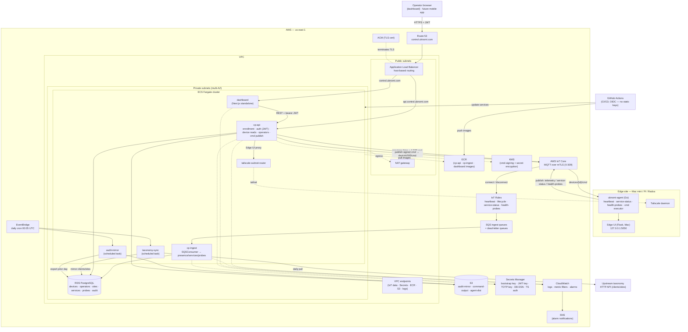

# Control Plane — Architecture Diagram

A wiring diagram of the uKnomi Control Plane (CP) and the AWS technologies it
runs on, reflecting the **currently deployed** Phase-1/2 system (single US
region, account `523612763411`). It complements the narrative in
[`architecture.md`](./architecture.md); the source of truth for the
infrastructure is the Terraform under [`infra/`](../infra).

> The diagram is [Mermaid](https://mermaid.live) — it renders on GitHub, and
> you can paste it into mermaid.live to export a PNG/SVG for slides.

## System wiring

## AWS technologies and what each does

| AWS service | Role in CP |
|---|---|
| **ECS Fargate** | Runs every CP workload serverlessly (no EC2): the `cp-api`, `dashboard`, `cp-ingest`, and `tailscale-subnet-router` long-lived services, plus the `taxonomy-sync` and `audit-mirror` scheduled tasks. |
| **Application Load Balancer** | Public entry point. Host-based routing: `control.uknomi.com` → dashboard, `api.control.uknomi.com` → cp-api. Health checks `GET /healthz`. |
| **Route 53 + ACM** | DNS zone `control.uknomi.com`; ACM issues the DNS-validated TLS cert the ALB terminates. |
| **AWS IoT Core** | The device command/telemetry broker — MQTT over per-device X.509 mTLS. Issues each device's thing + certificate at enrollment. IoT **Rules** route inbound topics to SQS; lifecycle (connect/disconnect) events drive fast online/offline. |
| **SQS (+ DLQs)** | Buffers the asynchronous device→CP data path (heartbeat, lifecycle, service-status, health-probes). `cp-ingest` long-polls; poison messages route to dead-letter queues. |
| **RDS PostgreSQL** | System of record: devices, operators, sites/clients mirror, services, health probes, audit log, idempotency. Migrations (goose) run on service startup. |
| **S3** | Three buckets: daily audit-log mirror, command stdout/stderr, and signed agent binaries for self-update. |
| **KMS** | Customer-managed key (`alias/uknomi-cp`) for command signing and encrypting secret material. |
| **Secrets Manager** | Bootstrap (enrollment) key, JWT signing key, TOTP encryption key, RDS DSN, Tailscale auth key. |
| **CloudWatch + SNS** | All logs (per-service log groups), metric filters, and alarms (ALB 5xx, RDS CPU/storage, service running-count, SQS DLQ depth, per-probe red counts, job-staleness). Alarms notify via SNS. |
| **EventBridge** | Cron (00:05 UTC daily) that triggers the `taxonomy-sync` and `audit-mirror` ECS tasks. |
| **ECR** | Holds the `cp-api`, `cp-ingest`, and `dashboard` container images, tagged by git SHA + `latest`. |
| **VPC (subnets, IGW, NAT, VPC endpoints)** | Public subnets host the ALB + NAT; private subnets host Fargate + RDS. VPC endpoints keep IoT-data/Secrets/ECR/S3/logs traffic on the AWS backbone. |
| **IAM + OIDC** | Per-task roles (no shared secrets between tasks); GitHub Actions authenticates via OIDC federation (scoped to the repo's `main`) to push images and update services — no long-lived AWS keys. |
| **Tailscale subnet router** | A Fargate task on the tailnet; cp-api reverse-proxies operator traffic to each device's localhost Edge UI through it, so clients never join the tailnet. |

## Key flows (numbered to the diagram)

1. **Operator access** — Browser → Route 53 → ALB (TLS via ACM). Dashboard (Next.js) is a thin client; every data/action call goes to `cp-api` as REST with a bearer JWT. Auth is local: Argon2id password + mandatory TOTP, issued by cp-api (ADR-010) — no external IdP.
2. **Enrollment** — Install script calls `POST /enrollments` with the bootstrap key; cp-api provisions an IoT thing + X.509 cert and inserts the device row. (See the enrollment sequence in `architecture.md`.)
3. **Telemetry ingest (async)** — The agent publishes heartbeat/service-status/health-probes over MQTT; IoT Rules drop them onto SQS; `cp-ingest` consumes and writes Postgres (presence, service states, probe results). IoT connect/disconnect events give fast online/offline edges.
4. **Commands (Phase 3 design)** — cp-api records a pending command, signs it (Ed25519 via KMS), and publishes to `devices/{id}/cmd`; the agent verifies and executes; results return on `devices/{id}/cmd-result` and are ingested.
5. **Scheduled jobs** — EventBridge fires `taxonomy-sync` (pull clients/sites from the upstream HTTP API → mirror into Postgres, ADR-033) and `audit-mirror` (export the prior UTC day's audit log to S3) daily.
6. **CI/CD** — GitHub Actions builds images, authenticates via OIDC, pushes to ECR, and rolls the Fargate services.

## Notes / scope

- **Built and deployed:** everything in the diagram except the command channel (#4), which is designed but Phase 3.
- **Edge UI proxy** runs over Tailscale, a separate path from the IoT command/telemetry channel (ADR-003).
- Time-series metrics (CPU/mem/disk history) via **Timestream** are planned (ADR-016) and not yet wired; presence today is the `last_seen`/`is_online` columns in Postgres.

---

*A pre-rendered image of the diagram above lives at
[`img/cp-architecture.png`](./img/cp-architecture.png) for slides/exports. It
is generated from the Mermaid source with
`mmdc -i <this file's mermaid block> -o docs/img/cp-architecture.png -b white -s 2`
(`@mermaid-js/mermaid-cli`); regenerate it when the diagram changes.*
